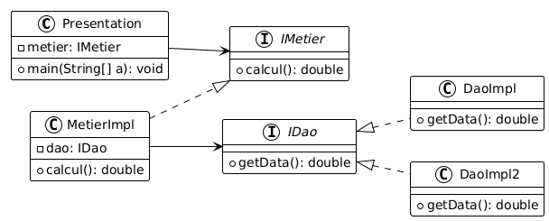

# Inversion of Control and Dependency Injection in JEE

## Overview
- **Inversion of Control (IoC):** A design principle where object creation and lifecycle management are delegated to a framework instead of being manually handled in the code.
- **Dependency Injection (DI):** A technique that enables injecting dependencies into a class rather than having the class create them itself, fostering better modularity and separation of concerns.

## Class Diagram



### 1. Static Instantiation for Dependency Injection
This approach involves directly instantiating dependencies within the code. While straightforward, it limits flexibility and complicates maintenance.

#### Example:
```java
public static void main(String[] args) {
    // Dependency injection via XML configuration
    ApplicationContext context = new ClassPathXmlApplicationContext("config.xml");
    IMetier metier = (IMetier) context.getBean("metier");
    System.out.println("Result: " + metier.calcul());
}
```

### 2. Dynamic Instantiation for Dependency Injection
In this approach, dependency instantiation occurs at runtime using Java reflection, offering greater flexibility by dynamically loading classes from a configuration file.

#### Example:
```java
public static void main(String[] args) throws Exception {
    // Dynamic instantiation for dependency injection
    try {
        try (Scanner scanner = new Scanner(ResourceUtils.getFile("classpath:config.txt"))) {
            String daoClassName = scanner.nextLine();
            Class<?> cDao = Class.forName(daoClassName);
            IDao dao = (IDao) cDao.getConstructor().newInstance();

            String metierClassName = scanner.nextLine();
            Class<?> cMetier = Class.forName(metierClassName);
            IMetier metier = (IMetier) cMetier.getConstructor().newInstance();

            Method method = cMetier.getMethod("setDao", IDao.class);
            method.invoke(metier, dao);
        }
    } catch (Exception e) {
        e.printStackTrace();
    }
}
```

## Leveraging Spring for Dependency Injection
Spring provides a streamlined way to manage dependencies using XML configurations or annotations.

### XML-Based Dependency Injection
Dependencies are declared in a [`config.xml`](src/main/resources/config.xml) configuration file.

#### Example:
```xml
<?xml version="1.0" encoding="UTF-8"?>
<beans xmlns="http://www.springframework.org/schema/beans"
       xmlns:xsi="http://www.w3.org/2001/XMLSchema-instance" 
       xmlns:util="http://www.springframework.org/schema/util"
       xsi:schemaLocation="http://www.springframework.org/schema/beans 
       http://www.springframework.org/schema/beans/spring-beans.xsd 
       http://www.springframework.org/schema/util 
       https://www.springframework.org/schema/util/spring-util.xsd">
    
    <bean id="dao" class="dao.DaoImpl"></bean>
    <bean id="metier" class="metier.MetierImpl">
        <property name="dao" ref="dao" />
    </bean>
</beans>
```
### Annotation-Based Dependency Injection
Spring allows dependencies to be managed using annotations directly within class definitions.

#### Example:
```java
@Component("dao")
public class DaoImpl implements IDao {
    @Override
    public double getData() {
        System.out.println("Database version");
        return 24.5;
    }
}
```